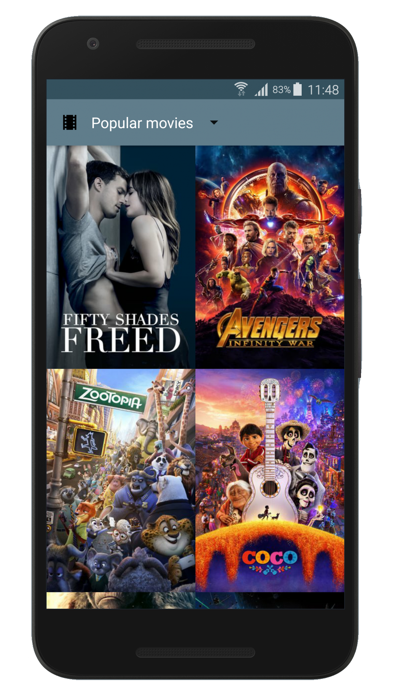
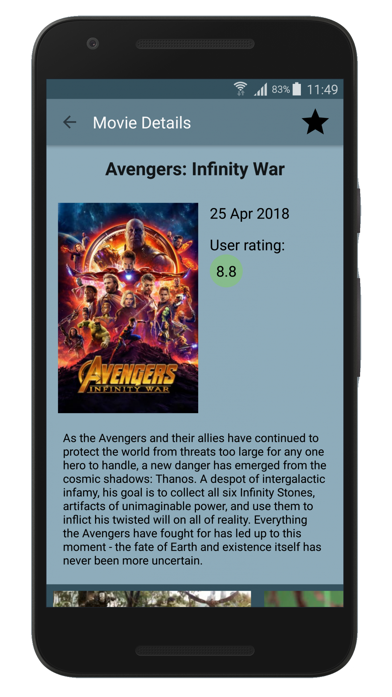
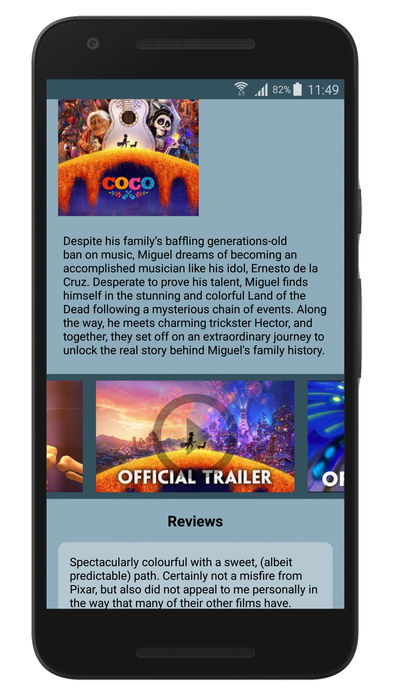
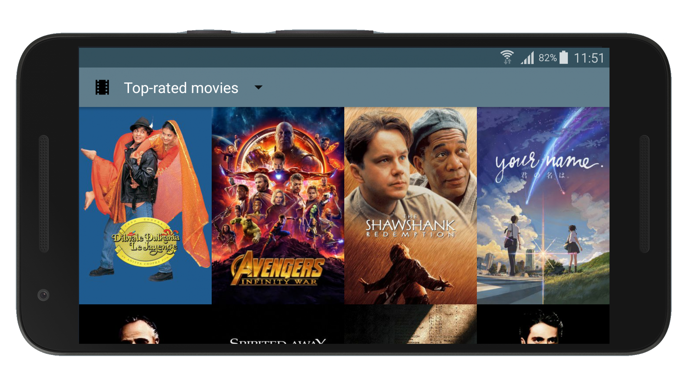

# Popular Movies App

A simple app to discover new movies. 
It is one of the projects for Udacity Android Developer Nanodegree. 

## Features 
- Browse most popular and most the highest rated movies
- Mark as favorites the movies that you like 
- See description, release date and average score of the movie
- Watch trailers and read reviews
- Enjoy material design of the app while you browse the movies

## Screenshots

   



## Requirements

This application uses themoviedb.org API to load information about movies. To launch the application on your device, you need to request your [API key][1]. Put the key to the gradle.properties file as follows:

```
ApiKey = "your_api_key_here"
```

## Libraries

* [Android Architecture Components][2] (LiveData, ViewModel)
* [Dagger 2][3]
* [Retrofit][4]
* [Picasso][5]

License
-------
```
Copyright 2018 Roman Potapov

Licensed under the Apache License, Version 2.0 (the "License");
you may not use this file except in compliance with the License.
You may obtain a copy of the License at

   http://www.apache.org/licenses/LICENSE-2.0

Unless required by applicable law or agreed to in writing, software
distributed under the License is distributed on an "AS IS" BASIS,
WITHOUT WARRANTIES OR CONDITIONS OF ANY KIND, either express or implied.
See the License for the specific language governing permissions and
limitations under the License.
```

[1]: https://www.themoviedb.org/faq/api
[2]: https://developer.android.com/topic/libraries/architecture
[3]: https://github.com/google/dagger
[4]: https://github.com/square/retrofit
[5]: https://github.com/square/picasso

